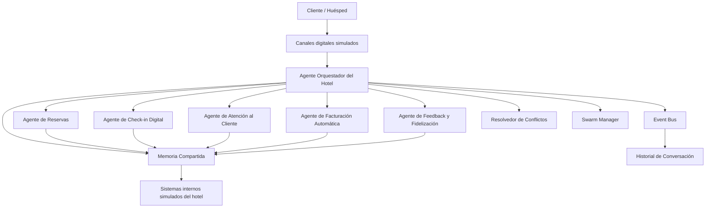

# Hotel Inteligente con 5 Agentes de IA

Este proyecto implementa una solución de automatización integral basada en una arquitectura multiagente para los procesos de un hotel. Fue desarrollado para cumplir con el nivel de Excelencia (20/20) del curso "Automatización Inteligente de Procesos".

## 1. Descripción del Caso del Hotel
El proyecto automatiza el ciclo de vida completo de un huésped en un hotel, gestionando reservas, check-in, estadía, facturación y feedback mediante inteligencia artificial.

## 2. Problema AS-IS
Ver detalles en [docs/bpmn_as_is.md](docs/bpmn_as_is.md). Resumen: Cuellos de botella manuales, alta tasa de error en reservas, falta de personalización, filas en check-in y facturación demorada.

## 3. Proceso TO-BE
Ver detalles en [docs/bpmn_to_be.md](docs/bpmn_to_be.md). Resumen: Agentes IA asumen tareas operativas, coordinados por un Orquestador. Todo se maneja por eventos asíncronos y memoria compartida garantizando eficiencia y cero filas.

## 4. Arquitectura Multiagente
Se emplea una **Arquitectura Jerárquica con Flujo Pipeline**. 



## 5. Justificación de Arquitectura
**Jerárquica con Pipeline:** Elegida porque el ciclo hotelero tiene un flujo de estados claro (Reserva -> Checkin -> Checkout). Un Orquestador valida JSON y enruta.
**Por qué no estrella pura:** Porque el flujo es en etapas, no son agentes completamente independientes sin estado.
**Por qué no malla pura:** La malla pura generaría caos comunicacional sin un validador central.

## 6. Agentes del Sistema
1. **Orquestador:** Enruta, valida schemas, detecta swarms.
2. **Reservas:** Busca disponibilidad y asigna.
3. **Check-in Digital:** Valida identidad.
4. **Atención al Cliente:** Limpieza, room service y mantenimiento.
5. **Facturación:** Calcula impuestos, genera facturas.
6. **Feedback:** Sentimiento, quejas y promociones de lealtad.

## 7. Componentes Core
* **Memoria Compartida:** (`core/shared_memory.py`) Fuente única de la verdad.
* **Event Bus:** (`core/event_bus.py`) Comunicación asíncrona entre agentes.
* **Swarm Manager:** Ejecuta tareas multiagente concurrentes (Ej: Queja + Salida).
* **Resolución de Conflictos:** Detecta sobreventa, doble reserva y escalas.

## 8. Comunicación JSON/MCP
Toda la comunicación Orquestador <-> Subagente es un payload JSON estandarizado, validado usando `jsonschema` en la carpeta `schemas/`.

## 9. Datos Simulados
Variables y estatus (Habitaciones, Huéspedes, Consumos) se persisten en JSONs dentro de `data/`.

## 10. Instalación y Ejecución
```bash
# Instalación de dependencias
pip install -r requirements.txt

# Ejecución de la Demo
python main.py
```

## 11. Pruebas y Métricas
* Para ejecutar los tests unitarios: `pytest tests/`
* El archivo de métricas se genera automáticamente en `metrics/results.json` con latencias y tasas de éxito.

**Nota sobre Escenarios Negativos:**
Los escenarios que resultan en rechazos (como una reserva sin disponibilidad o check-in inválido) o escalamientos a humanos (como mantenimientos mayores) son **pruebas controladas**. Cuando el sistema los maneja adecuadamente según sus reglas de negocio y schemas, cuenta como un **Éxito Funcional** y no como un error del sistema.

## 12. Defensa del Proyecto
Revisar [docs/defense_script.md](docs/defense_script.md) para el guion y preguntas frecuentes del jurado.
