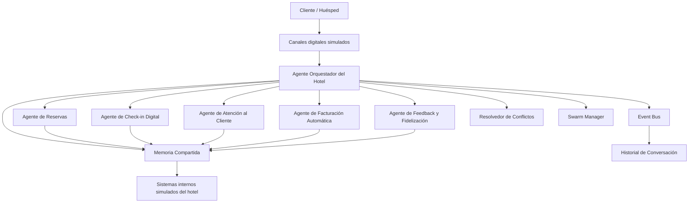

# Arquitectura Multiagente

## Descripción Técnica
El sistema implementa una arquitectura jerárquica con flujo tipo pipeline.
Un Agente Orquestador actúa como enrutador y coordinador central, delegando tareas
a 5 subagentes especializados según la etapa del ciclo del huésped.

## Diagrama

## Flujo de Comunicación
1. El huésped envía una petición al Orquestador.
2. El Orquestador valida la intención y formatea a JSON.
3. El subagente recibe el JSON, procesa y actualiza la Memoria.
4. El subagente publica un Evento en el Event Bus.
5. El Orquestador recibe la respuesta, gestiona Swarms o Conflictos si los hay, y devuelve respuesta al huésped.

## Responsabilidades
- **Orquestador:** Enrutamiento, control de latencias, validación JSON.
- **Reservas:** Consultas de disponibilidad, creación y cancelación.
- **Check-in:** Validación de identidad y asignación de habitaciones.
- **Atención:** Recepción y resolución (o escalamiento) de incidencias.
- **Facturación:** Cálculo total, aplicación de cargos, emisión de comprobantes.
- **Feedback:** Análisis de sentimiento y alertas.
