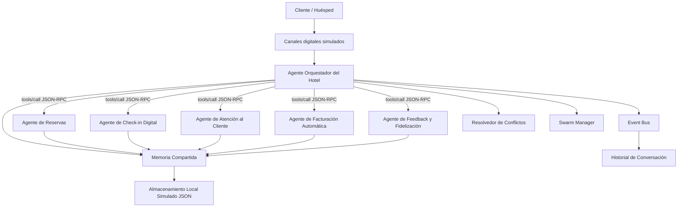

# Arquitectura Multiagente

## Descripción Técnica
El sistema implementa una arquitectura jerárquica con flujo tipo pipeline de extremo a extremo. Un Agente Orquestador actúa como enrutador y coordinador central, delegando tareas a 5 subagentes especializados según la etapa del ciclo del huésped.

Esta versión se despliega localmente utilizando **Streamlit** para la visualización interactiva del sistema y persiste el estado mediante almacenamiento local simulado en archivos JSON dentro del directorio `data/`.

---

## 🔌 Capa MCP (Model Context Protocol)
El sistema ha integrado una capa nativa compatible con **Model Context Protocol (MCP)** para coordinar las llamadas entre el Agente Orquestador y los subagentes especializados:

1.  **JSON-RPC 2.0:** Todas las peticiones se encapsulan en envolturas de llamada JSON-RPC estándar (`jsonrpc`, `method`, `params`, `id`).
2.  **Tools API:** Los subagentes se registran dinámicamente como herramientas MCP (`tools/list`). Para ejecutarlos, el Orquestador llama al endpoint `tools/call` enviando el payload de parámetros estructurados.
3.  **Esquemas Strict:** Los parámetros de entrada de cada herramienta se validan contra sus respectivos JSON Schemas ubicados en `schemas/` mediante el validador MCP.

---

## Diagrama de la Arquitectura

---

## Componentes y Flujo de Comunicación
1.  **Orquestador:** Recibe las peticiones del huésped, detecta si es un Swarm o llamada singular, y despacha a la capa MCP.
2.  **Capa MCP:** Valida la estructura del mensaje y el JSON Schema de la herramienta, ejecutando el subagente correspondiente.
3.  **Subagente:** Ejecuta su lógica de negocio sobre la **Memoria Compartida** y publica los resultados correspondientes en el **Event Bus** de forma asíncrona.
4.  **Swarm Manager:** Coordina la ejecución simultánea de tareas asignadas a múltiples agentes en un entorno de colaboración de Swarms (ej: Checkout + Queja).
5.  **Resolvedor de Conflictos:** Monitorea y soluciona colisiones lógicas en el estado compartido, como la sobreasignación de habitaciones.
